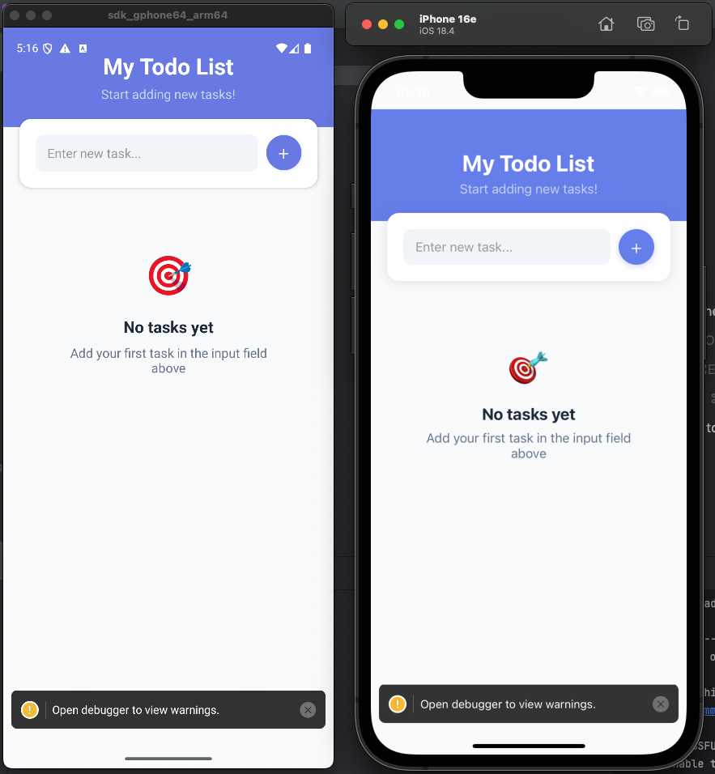

# 📝 TodoList React Native App



A cross-platform TodoList application built with React Native, TypeScript, and automatic Java 17 detection.

## ✨ Features

- ✅ **Add Tasks** - Add new todo items via input box and button
- 🎯 **Mark Complete** - Tap items to toggle completion status  
- 🗑️ **Delete Items** - Tap trash icon to delete items with confirmation dialog
- 🧹 **Clear Completed** - Clear all completed items with one tap
- 📊 **Real-time Statistics** - Shows total and completed task counts
- 🌗 **Dark Mode** - Automatically adapts to system theme
- 📱 **Cross-platform** - iOS & Android support
- 🔧 **Safe Area Handling** - Proper layout on all devices
- ☕ **Automatic Java 17 Detection** - Seamless builds without manual configuration
- 🇺🇸 **English Interface** - Complete English interface

## 🎨 Design Features

- **Responsive Design** - Adapts to different screen sizes
- **Modern UI** - Uses rounded corners, shadows, and modern design elements
- **Visual Feedback** - Button states and animation effects
- **Dark Mode** - Automatically switches between light/dark themes
- **Intuitive Operations** - Follows mobile device usage patterns

## 🛠️ Technology Stack

- **Framework**: React Native 0.81
- **Language**: TypeScript  
- **State Management**: React Hooks (useState)
- **Styling**: StyleSheet API
- **Safe Area**: react-native-safe-area-context
- **Platform**: Android & iOS

## 📦 Prerequisites

- Node.js >= 20
- Java 17-20 (automatically detected)
- Xcode (for iOS development)
- Android Studio (for Android development)

## 🚀 Getting Started

### Installation

```bash
npm install
```

### iOS Setup (First time only)

```bash
cd ios && pod install && cd ..
```

### Running the App

#### iOS
```bash
npm run ios
```

#### Android  
```bash
npm run android
```

#### Development Server
```bash
npm start
```

## 📋 Available Scripts

- `npm run ios` - Build and run on iOS (auto-detects Java 17)
- `npm run android` - Build and run on Android (auto-detects Java 17)  
- `npm run ios:direct` - Run iOS without Java detection
- `npm run android:direct` - Run Android without Java detection
- `npm start` - Start Metro bundler
- `npm test` - Run tests
- `npm run lint` - Run ESLint

## ☕ Java Requirements

This project automatically detects and uses Java 17 for builds. The smart script will:

- 🔍 Search for Java 17 installations automatically
- 🎯 Prioritize Temurin and AdoptOpenJDK distributions
- ✅ Verify Java version compatibility
- 🚀 Set correct JAVA_HOME automatically

If you need to manually set Java:

```bash
export JAVA_HOME=/path/to/java17
npm run ios:direct
```

## 📁 Project Structure

```
TodoListReactNative/
├── App.tsx                 # Main app component
├── scripts/
│   └── find-java17.sh     # Auto Java 17 detection
├── android/               # Android-specific code
├── ios/                   # iOS-specific code  
├── README/
│   └── illustration.png   # App screenshot
└── package.json          # Dependencies and scripts
```

## 🔧 Safe Area Handling

This app uses `react-native-safe-area-context` to properly handle device safe areas across different screen sizes and orientations, ensuring content is never hidden behind:

- Status bars
- Navigation bars
- Home indicators
- Dynamic island (iPhone 14 Pro/Pro Max)

## 🎯 Build Status

- ✅ **Project Setup**: React Native project successfully created
- ✅ **Core Features**: All todo list functions implemented
- ✅ **TypeScript**: No compilation errors, type safe
- ✅ **English Localization**: Complete English interface
- ✅ **Android Testing**: Successfully built and running on emulator
- ✅ **iOS Testing**: Successfully built and running on simulator
- ✅ **Safe Area**: Proper layout handling on all devices
- ✅ **Java Auto-detection**: Seamless builds without manual Java configuration

## 🐛 Troubleshooting

### Java Issues
If you encounter Java-related issues:
1. The app will automatically find Java 17
2. Install Java 17 if not found: `brew install openjdk@17`
3. Use direct scripts if auto-detection fails

### General Issues
For other issues, run:
```bash
npx react-native doctor
```

### iOS Build Issues
If iOS build fails:
1. Ensure Xcode is installed and updated
2. Run `cd ios && pod install && cd ..`
3. Clean build: `cd ios && xcodebuild clean && cd ..`

### Android Build Issues
If Android build fails:
1. Ensure Android Studio and SDK are properly installed
2. Check ANDROID_HOME environment variable
3. Ensure device/emulator is connected: `adb devices`

## 📄 License

This project is open source and available under the [MIT License](LICENSE).

## 🤝 Contributing

Contributions, issues, and feature requests are welcome!

```sh
bundle install
```

Then, and every time you update your native dependencies, run:

```sh
bundle exec pod install
```

For more information, please visit [CocoaPods Getting Started guide](https://guides.cocoapods.org/using/getting-started.html).

```sh
# Using npm
npm run ios

# OR using Yarn
yarn ios
```

If everything is set up correctly, you should see your new app running in the Android Emulator, iOS Simulator, or your connected device.

This is one way to run your app — you can also build it directly from Android Studio or Xcode.

## Step 3: Modify your app

Now that you have successfully run the app, let's make changes!

Open `App.tsx` in your text editor of choice and make some changes. When you save, your app will automatically update and reflect these changes — this is powered by [Fast Refresh](https://reactnative.dev/docs/fast-refresh).

When you want to forcefully reload, for example to reset the state of your app, you can perform a full reload:

- **Android**: Press the <kbd>R</kbd> key twice or select **"Reload"** from the **Dev Menu**, accessed via <kbd>Ctrl</kbd> + <kbd>M</kbd> (Windows/Linux) or <kbd>Cmd ⌘</kbd> + <kbd>M</kbd> (macOS).
- **iOS**: Press <kbd>R</kbd> in iOS Simulator.

## Congratulations! :tada:

You've successfully run and modified your React Native App. :partying_face:

### Now what?

- If you want to add this new React Native code to an existing application, check out the [Integration guide](https://reactnative.dev/docs/integration-with-existing-apps).
- If you're curious to learn more about React Native, check out the [docs](https://reactnative.dev/docs/getting-started).

# Troubleshooting

If you're having issues getting the above steps to work, see the [Troubleshooting](https://reactnative.dev/docs/troubleshooting) page.

# Learn More

To learn more about React Native, take a look at the following resources:

- [React Native Website](https://reactnative.dev) - learn more about React Native.
- [Getting Started](https://reactnative.dev/docs/environment-setup) - an **overview** of React Native and how setup your environment.
- [Learn the Basics](https://reactnative.dev/docs/getting-started) - a **guided tour** of the React Native **basics**.
- [Blog](https://reactnative.dev/blog) - read the latest official React Native **Blog** posts.
- [`@facebook/react-native`](https://github.com/facebook/react-native) - the Open Source; GitHub **repository** for React Native.
