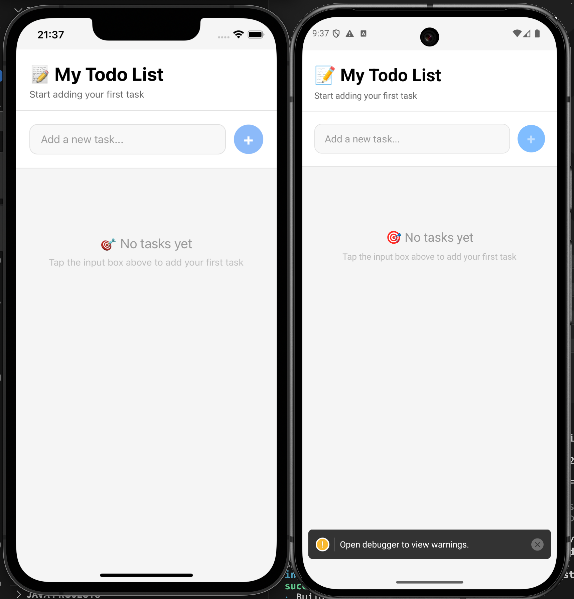

# 📝 TodoList React Native 應用程式



使用 React Native、TypeScript 開發的跨平台待辦事項應用程式，具備自動 Java 17 檢測功能。

## ✨ 功能特色

- ✅ **新增待辦事項** - 透過輸入框和按鈕新增項目
- 🎯 **標記完成** - 點擊項目切換完成狀態
- 🗑️ **刪除項目** - 點擊垃圾桶圖示刪除項目，附確認對話框
- 🧹 **清除已完成** - 一鍵清除所有已完成項目
- 📊 **即時統計** - 顯示總項目數和完成數量
- 🌗 **深色模式** - 自動適應系統主題
- 📱 **跨平台支援** - iOS & Android 雙平台
- 🔧 **安全區域處理** - 在所有設備上正確佈局
- ☕ **自動 Java 17 檢測** - 無需手動配置即可順暢建置
- 🇹🇼 **中文介面** - 完整繁體中文介面

## 🎨 設計特色

- **響應式設計** - 適配不同螢幕尺寸
- **現代化 UI** - 使用圓角、陰影等現代設計元素
- **視覺回饋** - 按鈕狀態、動畫效果
- **深色模式** - 自動切換淺色/深色主題
- **直覺操作** - 符合移動設備使用習慣

## 🛠️ 技術堆疊

- **框架**: React Native 0.81
- **語言**: TypeScript
- **狀態管理**: React Hooks (useState)
- **樣式**: StyleSheet API
- **安全區域**: react-native-safe-area-context
- **平台**: Android & iOS

## 📦 環境需求

- Node.js >= 20
- Java 17-20 (自動檢測)
- Xcode (iOS 開發用)
- Android Studio (Android 開發用)

## 🚀 開始使用

### 安裝相依套件

```bash
npm install
```

### iOS 初始設定 (僅首次執行)

```bash
cd ios && pod install && cd ..
```

### 執行應用程式

#### iOS
```bash
npm run ios
```

#### Android
```bash
npm run android
```

#### 開發伺服器
```bash
npm start
```

## 📋 可用指令

- `npm run ios` - 建置並執行 iOS 版本 (自動檢測 Java 17)
- `npm run android` - 建置並執行 Android 版本 (自動檢測 Java 17)
- `npm run ios:direct` - 執行 iOS 版本 (不檢測 Java)
- `npm run android:direct` - 執行 Android 版本 (不檢測 Java)
- `npm start` - 啟動 Metro bundler
- `npm test` - 執行測試
- `npm run lint` - 執行 ESLint

## ☕ Java 需求

此專案會自動檢測並使用 Java 17 進行建置。智能腳本會：

- 🔍 自動搜尋 Java 17 安裝位置
- 🎯 優先選擇 Temurin 和 AdoptOpenJDK 發行版
- ✅ 驗證 Java 版本相容性
- 🚀 自動設定正確的 JAVA_HOME

如需手動設定 Java：

```bash
export JAVA_HOME=/path/to/java17
npm run ios:direct
```

## 📁 專案結構

```
TodoListReactNative/
├── App.tsx                 # 主要應用程式元件
├── scripts/
│   └── find-java17.sh     # 自動 Java 17 檢測
├── android/               # Android 特定程式碼
├── ios/                   # iOS 特定程式碼
├── README/
│   └── illustration.png   # 應用程式截圖
└── package.json          # 相依套件和腳本
```

## 🔧 安全區域處理

此應用程式使用 `react-native-safe-area-context` 來正確處理不同螢幕尺寸和方向的設備安全區域，確保內容永遠不會被以下元素遮擋：

- 狀態列
- 導航列
- Home 指示器
- 動態島 (iPhone 14 Pro/Pro Max)

## 🎯 建置狀態

- ✅ **專案建立**: React Native 專案成功建立
- ✅ **核心功能**: 所有待辦事項功能已實作
- ✅ **TypeScript**: 無編譯錯誤，類型安全
- ✅ **中文本地化**: 完整中文介面
- ✅ **Android 測試**: 成功在模擬器上建置並執行
- ✅ **iOS 測試**: 成功在模擬器上建置並執行
- ✅ **安全區域**: 在所有設備上正確處理佈局
- ✅ **Java 自動檢測**: 無需手動 Java 配置即可順暢建置

## 🐛 疑難排解

### Java 相關問題
如遇到 Java 相關問題：
1. 應用程式會自動尋找 Java 17
2. 如找不到 Java 17，請安裝：`brew install openjdk@17`
3. 如自動檢測失敗，使用直接腳本

### 一般問題
對於其他問題，執行：
```bash
npx react-native doctor
```

### iOS 建置問題
如 iOS 建置失敗：
1. 確保已安裝並更新 Xcode
2. 執行 `cd ios && pod install && cd ..`
3. 清理建置：`cd ios && xcodebuild clean && cd ..`

### Android 建置問題
如 Android 建置失敗：
1. 確保已正確安裝 Android Studio 和 SDK
2. 檢查 ANDROID_HOME 環境變數
3. 確保設備/模擬器已連接：`adb devices`

## 📄 授權條款

此專案為開源軟體，採用 [MIT 授權條款](LICENSE)。

## 🤝 貢獻

歡迎貢獻程式碼、回報問題和提出功能請求！
